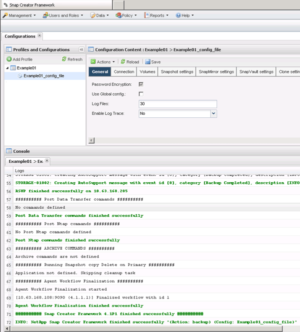

= Backups werden erstellt
:allow-uri-read: 
:icons: font
:imagesdir: ../media/

[role="lead"]
Sie können Backups über die Snap Creator GUI erstellen.

Eine der folgenden Voraussetzungen muss erfüllt sein:

* Eine Backup-Richtlinie muss in der Konfigurationsdatei definiert sein; oder
* Ein Richtlinienobjekt muss konfiguriert und dem Profil zugewiesen werden.
+

NOTE: Wenn ein Richtlinienobjekt definiert ist, überfordert es alle Einträge, die sich in der Konfigurationsdatei befinden.

+
.. Wählen Sie im Hauptmenü der Snap Creator GUI die Option *Verwaltung* > *Konfigurationen*.
.. Wählen Sie auf der Registerkarte *Configurations* im Fenster *Profile and Configuration* die Konfigurationsdatei aus.
.. Wählen Sie *Aktionen* > *Sicherung*.
+
image::../media/backup_select.gif[Auswahl der Sicherung]

.. Wählen Sie im Dialogfeld zusätzliche Parameter die Richtlinie aus und klicken Sie dann auf *OK*, um die Sicherung zu starten.
+

NOTE: Wenn der Konfiguration keine vom Benutzer erstellte Policy zugewiesen wird, stehen die verfügbaren Optionen stündlich, täglich, wöchentlich und monatlich in der Dropdown-Liste *Richtlinie* zur Verfügung. Wenn der Konfiguration eine oder mehrere benutzererstellte Richtlinien zugewiesen wurden, werden sie stattdessen in der Dropdown-Liste *Richtlinie* angezeigt.

+
image::../media/additional_parameters.gif[Zusätzliche Parameter]

.. Überprüfen Sie, ob Informationen zum Sicherungsauftrag im Fenster *Konsole* angezeigt werden.
+

+
In diesem Beispiel gibt die Ausgabe an, dass der Snap Creator Vorgang erfolgreich abgeschlossen wurde.

+

NOTE: Im Fensterbereich *Konsole* werden nur die für Sie relevanten Informationen angezeigt. Dies ist der ausführliche Modus. Um detaillierte Informationen über den gerade durchgeführten Job zu erhalten, wählen Sie oben auf der Seite *Berichte* > *Logs* aus. In der Ansicht Protokolle können Profil, Konfigurationsdatei, Protokolltyp und spezifisches Protokoll ausgewählt werden.

