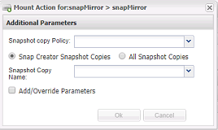

= Erstellen von Klonen aus einer vorhandenen Sicherung
:allow-uri-read: 
:icons: font
:imagesdir: ../media/

[role="lead"]
Sie können Volumes oder LUNs aus einem vorhandenen Backup als Quelle klonen.

* Der Snap Creator Server muss eine Kommunikation mit dem Storage-System durchführen.
* Sie müssen bei Snap Creator mit der erforderlichen Berechtigung zum Ausführen des Klonvorgangs angemeldet sein.

Dieser Klonvorgang besteht aus dem Mounten einer vorhandenen Snapshot Kopie und dann dem Klonen des vorhandenen Backups.

. Wählen Sie im Hauptmenü der Snap Creator GUI die Option *Verwaltung* > *Konfigurationen*.
. Wählen Sie auf der Registerkarte *Configurations* im Fenster *Profile and Configuration* eine Konfigurationsdatei aus.
. Wählen Sie *Aktionen* > *Halterung*.
. Wählen Sie im Dialogfeld zusätzliche Parameter den Controller, das Volume und die Richtlinie aus, die den zu montierenden Backup enthalten, und wählen Sie dann die zu montierende Snapshot Kopie (geklont) aus. Klicken Sie dann auf *OK*, um den Klonprozess zu starten.
+

+

NOTE: Notieren Sie den Namen der ausgewählten Snapshot Kopie. Beim Aufheben des Mounten des Backups muss derselbe Name für die Snapshot Kopie ausgewählt werden.

. Überprüfen Sie im Fenster *Konsole*, ob der Klonprozess erfolgreich war.

