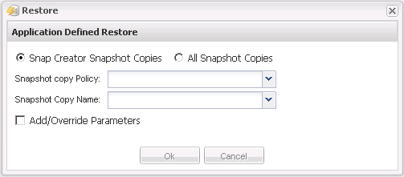

= Durchführen von applikationsdefinierten Restore-Vorgängen
:allow-uri-read: 
:icons: font
:imagesdir: ../media/

[role="lead"]
Wenn Sie VMware-, KVM- und Xen-Plug-ins verwenden, können Sie mithilfe der Snap Creator-GUI benutzerdefinierte Restore-Vorgänge durchführen.

In bestimmten VMware Umgebungen kann Restore-Vorgänge viel Zeit in Anspruch nehmen. In solchen Fällen können Sie entweder die Snap Creator CLI verwenden oder zwei Agenten einrichten: Einen für Backups und den anderen für die Wiederherstellung.

NOTE: VMware Restore-Vorgänge über die GUI werden nur für Snap Creator Agent unterstützt.

. Wählen Sie im Hauptmenü der Snap Creator GUI die Option *Verwaltung* > *Konfigurationen*.
. Wählen Sie auf der Registerkarte *Configurations* im Fenster Profile and Configuration die Konfigurationsdatei aus.
. Wählen Sie *Aktion* > *Wiederherstellen*.
+
Das Dialogfeld „Application Defined Restore“ wird im rechten Fensterbereich angezeigt.

. Geben Sie die Wiederherstellungsdetails ein und klicken Sie auf *OK*:
+

