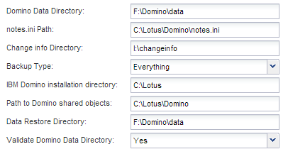

= Erstellen einer Konfigurationsdatei
:allow-uri-read: 
:icons: font
:imagesdir: ../media/

[role="lead"]
Bevor Sie IBM Domino-Datenbanken sichern können, müssen Sie eine Konfigurationsdatei erstellen. Die Konfigurationsdatei ist der Eingang für Snap Creator Backup- und Restore-Vorgänge.

Bei Konfigurations- und Profilnamen sind nur alphanumerische und unterstrichtere Zeichen zulässig. Die Namen können nicht mit einer Zahl beginnen.

TIP: Viele Standorte verwenden eine profilweite oder standortweite globale Konfigurationsdatei, um Speichersystem- oder VMware-Anmeldeinformationen für Backup- und Wiederherstellungskonfigurationen anzuwenden. Weitere Informationen zum Erstellen einer globalen Konfigurationsdatei finden Sie im https://library.netapp.com/ecm/ecm_download_file/ECMP12395422["Snap Creator Framework 4.1.2 – Administratorhandbuch"].

. Klicken Sie im Fenster Profile und Konfigurationen auf *Profil hinzufügen*.
. Geben Sie im Dialogfeld Neues Profil den Namen des Profils ein und klicken Sie dann auf *OK*.
+
Durch das Erstellen eines neuen Profils wird automatisch der Snap Creator Framework Configuration Wizard gestartet. Um einem vorhandenen Profil eine neue Konfiguration hinzuzufügen, klicken Sie mit der rechten Maustaste auf das Profil, und wählen Sie dann *Neue Konfiguration* aus.

+
Klicken Sie im Konfigurationsassistenten auf *Weiter*, um zur nächsten Seite zu gelangen, und klicken Sie auf *Zurück*, um zur vorherigen Seite zurückzukehren.

. Geben Sie auf der Seite Konfiguration den Namen der Konfiguration ein, und geben Sie dann an, ob Sie die Kennwortverschlüsselung aktivieren möchten.
+
Die Kennwortverschlüsselung ist standardmäßig aktiviert, um die Anzeige von Passwörtern im Klartext in der Konfigurationsdatei zu verhindern.

+

TIP: Bewegen Sie den Mauszeiger über ein Feld im Assistenten, um eine QuickInfo anzuzeigen.

. Wählen Sie auf der Seite Plug-in-Typ die Option *Anwendungs-Plug-in*.
. Wählen Sie auf der Seite Application Plug-ins *IBM Domino*.
. Geben Sie auf der Seite Plug-in-Parameter die Backup-Konfigurationsdetails für IBM Domino an:
+

NOTE: Die folgende Tabelle enthält Beispiele für UNIX Umgebungen. Sie können Beispiele für die Einstellungen für Windows in dem Screenshot anzeigen, der der Tabelle folgt.

+
|===
| GUI-Parameter | CLI-Parameter | Beschreibung 

 a| 
Domino Data Directory
 a| 
DOMINO_DATA_ PFAD
 a| 
Der Pfad zum Domino-Datenverzeichnis. Beispiel: /Domino/Data.

 a| 
notes.ini Pfad
 a| 
DOMINO_INI_PATH
 a| 
Der Pfad zur Datei notes.ini. Beispiel: /Domino/Data/notes.in

 a| 
Info-Verzeichnis ändern
 a| 
DOMINO_CHANGE_ INFO_PATH
 a| 
Der Pfad zu changeinfo-Dateien. Beispiel: /Changeinfo. *Wichtig:* Vergewissern Sie sich, dass Sie changeinfo-Dateien auf einem anderen Volume als dem Domino-Datenträger speichern.

 a| 
Backup-Typ
 a| 
DOMINO_ DATABASE_TYPE
 a| 
Die zu sichernden Datenbankdateien. Wählen Sie in der Dropdown-Liste GUI einen Wert aus, oder geben Sie im CLI-Befehl die entsprechende Zahl an:

** Alles (empfohlen) (CLI = 0)
** *.box-Dateien (CLI= 1)
** *.nsf-, *.nsg- und *.nsh-Dateien (CLI = 2)
** *.ntf-Dateien (CLI = 3)

 a| 
Installationsverzeichnis für IBM Domino
 a| 
LOTUS
 a| 
Der Pfad zu dem Verzeichnis, in dem Domino-Binärdateien installiert sind. Unter Linux zum Beispiel /opt/ibm/Domino (unter Annahme des Standardinstallationspfads). Unter Windows ist das übergeordnete Objekt des Verzeichnisses Domino Shared Objects. *Hinweis:* Dies ist nicht der Weg zu IBM Notes, früher Lotus Notes.

 a| 
Pfad zu freigegebenen Domino-Objekten
 a| 
Notes_ExecDirectory
 a| 
Der Pfad, der die freigegebenen Domino-Objektdateien (.so oder .dll) enthält. Beispiel: /Opt/ibm/Domino/Notes/latest/linux.

 a| 
Verzeichnis Zur Datenwiederherstellung
 a| 
DOMINO_ RESTORE_DATA_ PFAD
 a| 
Für Volume-Restores (vorausgesetzt, Sie wiederherstellen an demselben Speicherort von dem Sie das Backup durchgeführt haben), dem Domino Datenverzeichnispfad. Für die Wiederherstellung einer einzelnen Datei (nur NFS), einem Speicherort auf demselben Volume wie das Domino Data Directory. Beispiel: /Domino/Data/restore.

 a| 
Domino Data Directory Validieren
 a| 
VALIDIERUNG_ DOMINO_DATA_ PFAD
 a| 
Wenn die Domino Umgebung über mehrere Mount-Punkte verfügt, sind einige Mount-Punkte möglicherweise auf NetApp Storage vorhanden, während andere dies nicht tun. Wählen Sie im Dropdown-Menü GUI einen Wert aus, oder geben Sie im CLI-Befehl den entsprechenden Wert an:

** Ja sichert nur Dateien auf dem Domino-Datenverzeichnispfad.
** Keine Sicherung aller Dateien in der Domino Umgebung unabhängig von ihrem Speicherort auf der Festplatte.

|===
+
Das folgende Beispiel zeigt, wie Sie die Felder in einer Windows-Umgebung ausfüllen können:

+

. Geben Sie auf der Seite Agentenkonfiguration Snap Creator Agent-Verbindungsinformationen an:
+
|===
| Für dieses Feld... | Tun Sie das... 

 a| 
IP/DNS
 a| 
Geben Sie die IP-Adresse oder den DNS-Hostnamen des Snap Creator Agent Hosts ein.

 a| 
Port
 a| 
Wenn Sie den Standardport für den Snap Creator Agent (9090) nicht verwenden, geben Sie die Portnummer ein.

 a| 
Zeitüberschreitung (Sek.)
 a| 
Behalten Sie den Standardwert bei.

|===
. Wenn Sie mit Ihren Einträgen zufrieden sind, klicken Sie auf *Agent-Verbindung*, um die Verbindung zum Agenten zu überprüfen.
+

NOTE: Wenn der Agent nicht reagiert, überprüfen Sie die Details des Agenten und bestätigen Sie, dass die Auflösung des Host-Namens korrekt funktioniert.

. Geben Sie auf der Seite „Einstellungen für die Storage-Verbindung“ Verbindungsinformationen für die Storage Virtual Machine (SVM, ehemals bekannt als „Vserver“) im primären Storage-System an:
+
|===
| Für dieses Feld... | Tun Sie das... 

 a| 
Verkehr
 a| 
Wählen Sie das Transportprotokoll für die Kommunikation mit der SVM HTTP oder HTTPS aus.

 a| 
Controller/Vserver Port
 a| 
Wenn Sie den Standardport für die SVM nicht verwenden (80 für HTTP, 443 für HTTPS), geben Sie die Portnummer ein.

|===
+
*Hinweis:* Informationen zur Verwendung eines OnCommand-Proxys finden Sie im https://library.netapp.com/ecm/ecm_download_file/ECMP12395422["Snap Creator Framework 4.1.2 – Administratorhandbuch"].

. Geben Sie auf der Seite „Controller/Vserver Credentials“ die Anmeldeinformationen für die SVM auf dem primären Storage-System an:
+
|===
| Für dieses Feld... | Tun Sie das... 

 a| 
Controller/Vserver IP oder Name
 a| 
Geben Sie die IP-Adresse oder den DNS-Hostnamen des SVM-Hosts ein.

 a| 
Controller/Vserver Benutzer
 a| 
Geben Sie den Benutzernamen für den SVM-Host ein.

 a| 
Controller/Vserver Passwort
 a| 
Geben Sie das Passwort für den SVM-Host ein.

|===
+
*Wichtig:* wenn Sie planen, Snapshot Kopien an ein SnapMirrorror oder SnapVault Ziel zu replizieren, muss der Name der SVM, die Sie in diesem Schritt eingeben, exakt dem Namen der SVM entsprechen, die Sie beim Erstellen der SnapMirror- oder SnapVault-Beziehung verwendet haben. Wenn Sie beim Erstellen der Beziehung einen vollqualifizierten Domänennamen angegeben haben, müssen Sie in diesem Schritt einen vollständig qualifizierten Domänennamen angeben, unabhängig davon, ob SnapCreator die SVM mit den von Ihnen angegebenen Informationen finden kann. Fall ist von großer Bedeutung.

+
Mit dem befehl snapmirror show können Sie den Namen der SVM auf dem primären Storage-System überprüfen:snapmirror show -Destination-path Destination_SVM:Destination_Volume wobei Destination_SVM_Name der Name der SVM auf dem Zielsystem ist und Ziel_Volume das Volume ist. Weitere Informationen über das Erstellen von SnapMirror- und SnapVault-Beziehungen finden Sie unter xref:concept_snapmirror_and_snapvault_setup.adoc[Einrichtung von SnapMirror und SnapVault].

+
Wenn Sie auf *Weiter* klicken, wird das Fenster Controller/Vserver Volumes angezeigt.

. Geben Sie im Fenster Controller/Vserver Volumes die zu sichernden Volumes an, indem Sie die Liste der verfügbaren Volumes im linken Fensterbereich per Drag-and-Drop in die Liste der zu sichernden Volumes im rechten Fensterbereich ziehen und dann auf *Speichern* klicken.
+
Die angegebenen Volumes werden auf der Seite Controller/Vserver Credentials angezeigt.

+

IMPORTANT: Wenn Sie ein Backup des Verzeichnisses für changeinfo erstellen möchten, müssen Sie das Volume mit dem Verzeichnis als Metadaten-Volume konfigurieren, wie unter beschrieben xref:concept_use_meta_data_volumes_setting_to_back_up_the_changeinfo_directory.adoc[Sichern des Verzeichnis changeinfo]. Diese Option weist das IBM Domino Plug-in an, eine Snapshot Kopie des changeinfo-Volumes zu erstellen _nach_ die Snapshot Kopie für Datenbankdateien zu erstellen.

. Klicken Sie auf der Seite „Controller/Vserver Credentials“ auf *Add*, wenn Sie SVM-Details und Volumes angeben möchten, die für ein anderes primäres Speichersystem gesichert werden sollen.
. Geben Sie auf der Seite Snapshot Details die Informationen zur Snapshot Konfiguration an:
+
|===
| Für dieses Feld... | Tun Sie das... 

 a| 
Name Der Snapshot Kopie
 a| 
Geben Sie den Namen der Snapshot Kopie ein. *Tipp:* Klicken Sie *Duplicate Snapshot Copy Name* zulassen, wenn Sie Snapshot-Namen in Konfigurationsdateien wiederverwenden möchten.

 a| 
Label Für Snapshot Kopie
 a| 
Geben Sie einen beschreibenden Text für die Snapshot Kopie ein.

 a| 
Richtlinientyp
 a| 
Klicken Sie auf *Use Policy* und wählen Sie dann die integrierten Backup Policies aus, die Sie für diese Konfiguration zur Verfügung stellen möchten. Klicken Sie nach Auswahl einer Richtlinie in die Zelle *Retention*, um anzugeben, wie viele Snapshot-Kopien mit diesem Richtlinientyp beibehalten werden sollen. *Hinweis:* Informationen zur Verwendung von Policy-Objekten finden Sie im https://library.netapp.com/ecm/ecm_download_file/ECMP12395422["Snap Creator Framework 4.1.2 – Administratorhandbuch"].

 a| 
Das Löschen Von Snapshot Kopien Wird Verhindert
 a| 
Geben Sie nur „Ja“ an, wenn Snap Creator Snapshot Kopien nicht automatisch löschen soll, die die Anzahl der zu behaltenden Kopien überschreiten. *Hinweis:* Wenn Sie ja angeben, kann dies dazu führen, dass Sie die Anzahl der unterstützten Snapshot-Kopien pro Volume überschreiten.

 a| 
Alter Der Richtlinienaufbewahrung
 a| 
Geben Sie die Anzahl der Tage an, die Snapshot Kopien beibehalten werden sollen, die die Anzahl der zu behaltenden Kopien übersteigen. Sie können ein Aufbewahrungsalter pro Richtlinientyp festlegen, indem Sie den Richtlinientyp:Age eingeben, z. B. täglich:15.

 a| 
Benennungskonvention
 a| 
Behalten Sie den Standardwert bei.

|===
+
Die im folgenden Beispiel angegebene Konfiguration führt ein tägliches Backup durch und behält vier Snapshot Kopien bei:

+
image::../media/scfw_domino_snapshot_details_pane.gif[Dieses Bild wird durch den umgebenden Text erläutert.]

. Stellen Sie auf der Seite mit den Snapshot-Details * Anwendungsfehler ignorieren* auf Ja ein, wenn Sie den Backup-Vorgang erzwingen möchten, selbst wenn eine oder mehrere Datenbanken in einem inkonsistenten oder beschädigten Zustand vorliegen.
+
Sie sollten die übrigen Felder ignorieren.

+

TIP: Eine Umgebung mit Domino kann aus Hunderten oder Tausenden Datenbanken bestehen. Wenn sich selbst eine einzelne Datenbank in einem inkonsistenten oder beschädigten Zustand befindet, schlägt das Backup fehl. Durch die Aktivierung von *Anwendungsfehler ignorieren* kann die Sicherung fortgesetzt werden.

. Geben Sie auf der Seite Datensicherung an, ob Sie eine optionale Replizierung von Snapshot Kopien auf den sekundären Storage durchführen möchten:
+
.. Klicken Sie auf *SnapMirror*, um Snapshot Kopien zu spiegeln.
+
Die Richtlinie für gespiegelte Snapshot-Kopien ist dieselbe wie die Richtlinie für primäre Snapshot-Kopien.

.. Klicken Sie auf *SnapVault*, um Snapshot Kopien zu archivieren.
.. Geben Sie die Richtlinie für archivierte Snapshot Kopien an.
.. Die Anweisungen finden Sie im folgenden Schritt,13.
.. Geben Sie in *SnapVault Wartezeit* die Anzahl der Minuten ein, die Snap Creator warten soll, bis der SnapVault Vorgang abgeschlossen ist.
.. Sie müssen SnapMirror und SnapVault Beziehungen einrichten, bevor Sie die Replizierung auf den sekundären Storage durchführen. Weitere Informationen finden Sie unter xref:concept_snapmirror_and_snapvault_setup.adoc[Einrichtung von SnapMirror und SnapVault].

. Klicken Sie auf der Seite Datensicherungs-Volumes auf *Hinzufügen* und wählen Sie dann die SVM für das primäre Storage-System aus.
+
Wenn Sie auf *Weiter* klicken, wird das Fenster Data Protection Volume Selection angezeigt.

. Geben Sie im Auswahlfenster Data Protection Volume die zu replizierenden Quell-Volumes an, indem Sie die Liste der verfügbaren Volumes im linken Fensterbereich in die Liste der Volumes in den Bereichen SnapMirror und/oder SnapVault im rechten Fensterbereich ziehen und dann auf *Speichern* klicken.
+
Die angegebenen Volumes werden auf der Seite Data Protection Volumes angezeigt.

. Klicken Sie auf der Seite Datensicherungs-Volumes auf *Hinzufügen*, wenn Sie SVM-Details und Volumes angeben möchten, die für ein anderes primäres Speichersystem repliziert werden sollen.
. Geben Sie auf der Seite Datensicherungsbeziehungen die Zugangsdaten für die SVM auf den SnapMirror und/oder SnapVault Zielsystemen an.
. Wenn Sie NetApp OnCommand Unified Manager APIs anstelle von Data ONTAP APIs für Snapshot Kopien und SnapMirror/SnapVault Updates bevorzugen, füllen Sie die Felder auf der Seite DFM/OnCommand Einstellungen aus:
+
.. Klicken Sie auf *Operations Manager Console Alert*, wenn Sie Unified Manager-Warnungen erhalten möchten, und geben Sie dann die erforderlichen Verbindungsinformationen für die virtuelle Unified Manager-Maschine ein.
.. Klicken Sie auf *Datenschutzfunktion der NetApp Management Console*, wenn Sie die Datensicherheitsfunktion der NetApp Management Console für die 7-Mode SnapVault-Replikation verwenden, und geben Sie anschließend die erforderlichen Verbindungsinformationen für die Unified Manager Virtual Machine ein.

. Überprüfen Sie die Zusammenfassung und klicken Sie dann auf *Fertig stellen*.

Snap Creator führt die Konfigurationsdatei unter dem angegebenen Profil im Bereich Profile and Configurations auf. Sie können die Konfiguration bearbeiten, indem Sie die Konfigurationsdatei auswählen und im Bereich Konfigurationsinhalt auf die entsprechende Registerkarte klicken. Sie können die Konfiguration umbenennen, indem Sie im Kontextmenü auf *Umbenennen* klicken. Sie können die Konfiguration löschen, indem Sie im Kontextmenü auf *Löschen* klicken.
