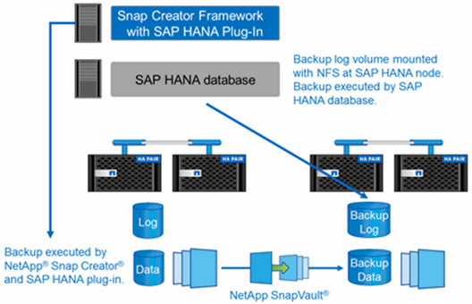

= Komponenten der Backup-Lösung
:allow-uri-read: 
:icons: font
:imagesdir: ../media/

[role="lead"]
Die Snap Creator Backup-Lösung für SAP HANA besteht aus SAP HANA Datendatei-Backup mit Storage-basierten Snapshot-Kopien, der Replizierung von Datendatei-Backups auf einen sekundären externen Backup-Standort, SAP HANA-Log-Datei-Backup mit der HANA-Datenbankprotokoll-Funktion, der Integritätsprüfung der Datenbankblöcke mithilfe eines dateibasierten Backups. Und allgemeine Ordnung und Sauberkeit der Datendateien, Backup von Protokolldateien und der SAP HANA Backup-Katalog.

Datenbank-Backups werden von Snap Creator in Verbindung mit einem Plug-in für SAP HANA ausgeführt. Das Plug-in sorgt für Datenbankkonsistenz, sodass die auf dem primären Storage-System erstellten Snapshot Kopien auf einem konsistenten Image der SAP HANA Datenbank basieren.

Snap Creator ermöglicht es Ihnen, die konsistenten Datenbank-Images mithilfe von SnapVault auf einen sekundären Storage zu replizieren. In der Regel werden für die Backups auf dem primären Storage und auf dem sekundären Storage unterschiedliche Aufbewahrungsrichtlinien definiert. Snap Creator verwaltet die Aufbewahrung auf dem primären und sekundären Storage.

Das Protokoll-Backup wird automatisch durch die SAP HANA Datenbank-Tools ausgeführt. Das Backup-Ziel für das Protokoll sollte sich nicht auf demselben Speichersystem befinden, auf dem sich das Protokollvolumen der Datenbank befindet. Die Konfiguration des Backup-Ziels für das Protokoll auf demselben sekundären Storage, auf dem die Datenbank-Backups mit SnapVault repliziert werden, wird empfohlen. Mit dieser Konfiguration gelten für den sekundären Storage ähnliche Verfügbarkeitsanforderungen als den primären Storage, sodass sicher ist, dass die Log-Backups immer auf den sekundären Storage geschrieben werden können.

Die Backup-Zeitpläne und Aufbewahrungsrichtlinien müssen auf Basis der Kundenanforderungen definiert werden. Die folgende Tabelle zeigt eine Beispielkonfiguration der verschiedenen Zeitpläne und Aufbewahrungsrichtlinien.

|===
|  | Ausgeführt von Snap Creator | Primärspeicher | Sekundär-Storage 

 a| 
Datenbank-Backups
 a| 
Zeitplan 1: Alle 4 Stunden
 a| 
Aufbewahrung: 6 (\=> 6 stündliche Snapshot-Kopien)
 a| 
Aufbewahrung: 6 (\=> 6 stündliche Snapshot-Kopien)

 a| 
Zeitplan 2: Einmal pro Tag
 a| 
Aufbewahrung: 3 (\=> 3 tägliche Snapshot-Kopien)
 a| 
Aufbewahrung: 28 (4 Wochen) (\=> 28 tägliche Snapshot Kopien)
 a| 
Backup-Protokollierung

 a| 
Zeitplan für SAP HANA Datenbank-Tools: Alle 15 Minuten
 a| 
NA
 a| 
Aufbewahrung: 28 Tage (4 Wochen)
 a| 
Block-Integritätsprüfung

|===
Mit diesem Beispiel werden sechs stündliche und drei tägliche Backups auf dem Primärspeicher aufbewahrt. Auf dem sekundären Storage werden die Datenbank-Backups für vier Wochen aufbewahrt. Um ein Daten-Backup wiederherstellen zu können, müssen Sie dieselbe Aufbewahrung für die Log-Backups festlegen.
