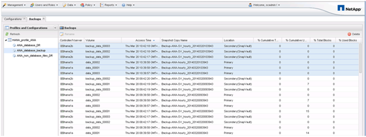

= Überprüfung verfügbarer Backups im SAP HANA Studio
:allow-uri-read: 
:icons: font
:imagesdir: ../media/

[role="lead"]
Die Liste der Storage Snapshot Backups finden Sie im SAP HANA Studio.

Der hervorgehobene Backup in der folgenden Abbildung zeigt eine Snapshot Kopie mit dem Namen „`Backup-ANA_hourly_20140320103943.`“ Dieses Backup umfasst Snapshot Kopien für alle drei Daten-Volumes des SAP HANA Systems. Das Backup ist auch auf dem sekundären Speicher verfügbar.

Der Name der Snapshot Kopie wird von Snap Creator als Backup-ID verwendet, wenn Snap Creator die Storage Snapshot Kopie im SAP HANA Backup-Katalog registriert. Im SAP HANA Studio ist das Storage Snapshot Backup im Backup-Katalog sichtbar. Die externe Backup-ID (EBID) hat den gleichen Wert wie der Name der Snapshot-Kopie, wie in der folgenden Abbildung dargestellt.

image::../media/sap_hana_backup_catalog.gif[Dieses Bild wird durch den umgebenden Text erläutert.]

Bei jedem Backup-Durchlauf löscht Snap Creator die Snapshot Backups auf der primären und sekundären Ablage auf der Grundlage der Aufbewahrungsrichtlinien für die verschiedenen Zeitpläne (stündlich, täglich usw.).

Snap Creator löscht auch die Backups im SAP HANA Backup-Katalog, wenn das Backup nicht auf dem primären oder sekundären Storage vorhanden ist. Der SAP HANA Backup-Katalog enthält immer eine vollständige Liste der Backups, die auf dem primären und/oder sekundären Storage verfügbar sind.
