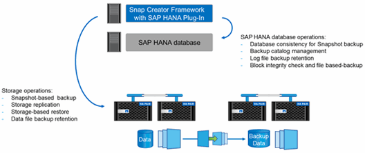

= Plug-in-Übersicht über SAP HANA
:allow-uri-read: 
:icons: font
:imagesdir: ../media/

[role="lead"]
Das SAP HANA Plug-in arbeitet mit Snap Creator Framework zusammen, um eine Backup-Lösung für SAP HANA Datenbanken bereitzustellen, die auf einem NetApp Storage Back-End basieren Die von Snap Creator erstellten Snapshot Backups sind im HANA-Katalog registriert und können im HANA Studio angezeigt werden.

Snap Creator Framework unterstützt zwei Arten von SAP HANA Datenbanken: Einzelne Container und mandantenfähige Datenbank-Container (MDC).

Snap Creator und das SAP HANA Plug-in werden von Data ONTAP 7-Mode und Clustered Data ONTAP unterstützt, wobei die SAP HANA Datenbank-Nodes über NFS oder Fibre Channel mit den Storage Controllern verbunden sind. Für Service Pack Stack (SPS) 7 und höher stehen die erforderlichen Schnittstellen zur SAP HANA-Datenbank zur Verfügung.

Snap Creator Framework kommuniziert mit den Storage-Systemen, um Snapshot Kopien zu erstellen und die Daten mithilfe von SnapVault auf einem sekundären Storage zu replizieren. Snap Creator wird zudem verwendet, um die Daten entweder mit SnapRestore auf dem primären Storage oder mit SnapVault Wiederherstellung vom sekundären Storage wiederherzustellen.

Das Snap Creator Plug-in für SAP HANA verwendet den SAP HANA hdbsql-Client, um SQL-Befehle auszuführen. Dies ermöglicht die Datenbankkonsistenz und das Management des SAP HANA Backup-Katalogs. Das SAP HANA Plug-in wird sowohl für SAP Certified Hardware Appliances als auch für Tailored Datacenter Integration (TDI) Programme unterstützt.

Das Snap Creator Plug-in für SAP HANA verwendet den SAP HANA hdbsql-Client, um SQL-Befehle für die folgenden Aufgaben auszuführen:

* Datenbankkonsistenz zur Vorbereitung eines Storage-basierten Snapshot-Backups
* Management der Backup-Aufbewahrung von Protokolldateien auf Filesystem-Ebene
* Management des SAP HANA Backup-Katalogs für Datei- und Log-Datei-Backups
* Führen Sie ein dateibasiertes Backup zur Überprüfung der Block-Integrität durch

Die folgende Abbildung zeigt einen Überblick über die Kommunikationswege von Snap Creator mit dem Storage und der SAP HANA Datenbank.

Snap Creator führt die folgenden Schritte zum Backup der Datenbank durch:

. Erstellung einer SAP HANA Datenbank-Snapshot-Kopie, um ein konsistentes Image auf der Persistenzschicht zu erhalten
. Erstellt eine Storage-Snapshot-Kopie des/der Daten-Volumes.
. Registrieren des Storage Snapshot Backups im SAP HANA Backup-Katalog
. Löscht die Snapshot Kopie von SAP HANA.
. Führt ein SnapVault-Update für das Daten-Volume aus.
. Löscht die Storage-Snapshot-Kopien im primären und/oder sekundären Storage basierend auf den definierten Aufbewahrungsrichtlinien für Backups im primären und sekundären Storage.
. Löscht die Einträge im SAP HANA Backup-Katalog, wenn die Backups nicht mehr auf dem primären und dem sekundären Speicher vorhanden sind.
. Löscht alle Log-Backups, die älter als die älteste Datensicherung im Filesystem und im SAP HANA Backup-Katalog sind.

