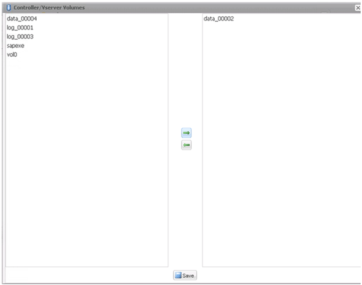
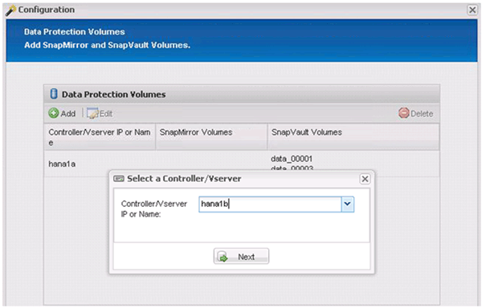

= Konfiguration des Snap Creator Framework und des Datenbank-Backups von SAP HANA
:allow-uri-read: 
:icons: font
:imagesdir: ../media/

[role="lead"]
Sie müssen Snap Creator Framework und das SAP HANA Datenbank-Backup konfigurieren.

. Verbinden Sie sich mit der grafischen Benutzeroberfläche des Snap Creator: https://host:8443/ui/[].
. Melden Sie sich mit dem Benutzernamen und Passwort an, die während der Installation konfiguriert wurden. Klicken Sie auf *Anmelden*.
+
image::../media/snap_creator_gui.gif[Zeigt die Snap Creator GUI-Anmeldung]

. Geben Sie einen Profilnamen ein und klicken Sie auf *OK*.
+
image::../media/sap_hana_user_profile.gif[sap hana-Benutzerprofil]

+
Beispiel: „`ANA`“ ist die SID der Datenbank.

. Geben Sie den Konfigurationsnamen ein, und klicken Sie auf *Weiter*.
+
image::../media/sap_hana_gui_for_configuration_name.gif[Zeigt den im Feld eingegebenen Konfigurationsnamen an]

. Wählen Sie als Plug-in-Typ * Application Plug-in* aus, und klicken Sie auf *Next*.
+
image::../media/sap_hana_config_plugin_type.gif[Zeigt das ausgewählte Anwendungs-Plug-in an]

. Wählen Sie als Anwendungs-Plug-in * SAP HANA* aus und klicken Sie auf *Weiter*.
+
image::../media/sap_hana_select_application_plug_in.gif[plug-in für sap hana Select-Applikation]

. Geben Sie die folgenden Konfigurationsdetails ein:
+
.. Wählen Sie im Dropdown-Menü * Ja* aus, um die Konfiguration mit einer mandantenfähigen Datenbank zu verwenden. Wählen Sie für eine einzelne Container-Datenbank *Nein*.
.. Wenn der Multitenant-Datenbank-Container auf *Nein* gesetzt ist, müssen Sie die Datenbank-SID angeben.
.. Wenn der Multitenant-Datenbank-Container auf *Ja* gesetzt ist, müssen Sie für jeden SAP HANA-Knoten die hdbuserstore-Schlüssel hinzufügen.
.. Fügen Sie den Namen der Mandanten-Datenbank hinzu.
.. Fügen Sie die HANA-Nodes hinzu, auf denen die hdbsql-Anweisung ausgeführt werden muss.
.. Geben Sie die HANA-Node-Instanznummer ein.
.. Geben Sie den Pfad zur ausführbaren Datei hdbsql an.
.. Fügen Sie den OSDB-Benutzer hinzu.
.. Wählen Sie in der Dropdown-Liste *Ja* aus, um DIE PROTOKOLLBEREINIGUNG zu aktivieren.
+
HINWEIS:

+
*** Parameter `HANA_SID` Ist nur verfügbar, wenn der Wert für Parameter `HANA_MULTITENANT_DATABASE` Ist auf festgelegt `N`
*** Für mandantenfähige Datenbank-Container (MDC) mit einem Ressourcentyp „`Single Tenant`“ arbeiten die SAP HANA Snapshot-Kopien mit der Key-basierten Authentifizierung von UserStore. Wenn der `HANA_MULTITENANT_DATABASE` Parameter ist auf festgelegt `Y`, Dann der `HANA_USERSTORE_KEYS` Parameter muss auf den entsprechenden Wert gesetzt werden.
*** Ähnlich wie bei nicht-mandantenfähigen Datenbank-Containern wird die Funktion für dateibasiertes Backup und Integritätsprüfung unterstützt

.. Klicken Sie Auf *Weiter*.

+
image::../media/file_based_backup_configuration.gif[File-basierte Backup-Konfiguration]

. Aktivieren Sie den dateibasierten Backup-Vorgang:
+
.. Legen Sie den Speicherort für die Dateisicherung fest.
.. Geben Sie das Präfix für die Dateisicherung an.
.. Aktivieren Sie das Kontrollkästchen *Datei-Backup aktivieren*.
.. Klicken Sie Auf *Weiter*.
+
image::../media/enable_file_based_backup.gif[Aktivieren Sie dateibasiertes Backup]

. Aktivieren Sie die Datenbankintegritätsprüfung:
+
.. Legen Sie den Speicherort für die temporäre Datei-Sicherung fest.
.. Aktivieren Sie das Kontrollkästchen * DB-Integritätsprüfung aktivieren*.
.. Klicken Sie Auf *Weiter*.

+
image::../media/integrity_checks.gif[Datenbankintegritätsprüfung]

. Geben Sie die Details für den Konfigurationsparameter des Agenten ein, und klicken Sie auf *Weiter*.
+
image::../media/sap_hana_agent_configuration_parameter.gif[Dieses Bild wird durch den umgebenden Text erläutert.]

. Geben Sie die Einstellungen für die Speicherverbindung ein, und klicken Sie auf *Weiter*.
+
image::../media/sap_hana_storage_connect_gui.gif[Dieses Bild wird durch den umgebenden Text erläutert.]

. Geben Sie die Anmeldedaten für den Speicher ein, und klicken Sie auf *Weiter*.
+
image::../media/sap_hana_storage_login_credentials_gui.gif[Dieses Bild wird durch den umgebenden Text erläutert.]

. Wählen Sie die auf diesem Speicher-Controller gespeicherten Datenvolumen aus und klicken Sie auf *Speichern*.
+
image::../media/sap_hana_select_data_volumes.gif[Dieses Bild wird durch den umgebenden Text erläutert.]

. Klicken Sie auf *Hinzufügen*, um einen weiteren Speicher-Controller hinzuzufügen.
+
image::../media/sap_hana_add_controller.gif[Dieses Bild wird durch den umgebenden Text erläutert.]

. Geben Sie die Anmeldedaten für den Speicher ein, und klicken Sie auf *Weiter*.
+
image::../media/sap_hana_storage_login_credentials2.gif[Dieses Bild wird durch den umgebenden Text erläutert.]

. Wählen Sie die Datenvolumen aus, die auf dem zweiten Speicher-Controller gespeichert sind, den Sie erstellt haben, und klicken Sie auf *Speichern*.
+

. Im Fenster Controller/Vserver Credentials werden die hinzugefügten Storage Controller und Volumes angezeigt. Klicken Sie Auf *Weiter*.
+
image::../media/sap_hana_view_storage_credentials.gif[Dieses Bild wird durch den umgebenden Text erläutert.]

. Geben Sie die Konfiguration der Snapshot-Richtlinie und -Aufbewahrung ein.
+
Die Aufbewahrung von drei täglichen und acht stündlichen Snapshot-Kopien ist nur ein Beispiel, das je nach Kundenanforderungen unterschiedlich konfiguriert werden könnte.

+

NOTE: Wählen Sie als Namensgebungskonvention *Zeitstempel* aus. Die Verwendung der Namenskonvention *Recent* wird mit dem SAP HANA Plug-in nicht unterstützt, da der Zeitstempel der Snapshot Kopie auch für die SAP HANA Backup Katalog Einträge verwendet wird.

+
image::../media/sap_hana_snapshot_details_gui.gif[Dieses Bild wird durch den umgebenden Text erläutert.]

. Es sind keine Änderungen erforderlich. Klicken Sie Auf *Weiter*.
+
image::../media/sap_hana_snapshot_details_continued_gui.gif[Dieses Bild wird durch den umgebenden Text erläutert.]

. Wählen Sie *SnapVault* aus, und konfigurieren Sie die SnapVault-Aufbewahrungsrichtlinien und die SnapVault-Wartezeit.
+
image::../media/sap_hana_data_protection_gui.gif[Dieses Bild wird durch den umgebenden Text erläutert.]

. Klicken Sie Auf *Hinzufügen*.
+
image::../media/sap_hana_data_protection_volumes.gif[Dieses Bild wird durch den umgebenden Text erläutert.]

. Wählen Sie einen Quell-Speicher-Controller aus der Liste aus, und klicken Sie auf *Weiter*.
+
image::../media/sap_hana_dp_volumes_gui_select_storage_controller.gif[Dieses Bild wird durch den umgebenden Text erläutert.]

. Wählen Sie alle Volumes aus, die auf dem Quell-Speicher-Controller gespeichert sind, und klicken Sie auf *Speichern*.
+
image::../media/sap_hana_volume_selection_gui.gif[Dieses Bild wird durch den umgebenden Text erläutert.]

. Klicken Sie auf *Hinzufügen*, und wählen Sie den zweiten Quell-Speicher-Controller aus der Liste aus, und klicken Sie dann auf *Weiter*.
+

. Wählen Sie alle Volumes aus, die auf dem zweiten Quell-Speicher-Controller gespeichert sind, und klicken Sie auf *Speichern*.
+
image::../media/sap_hana_data_protection_volume_selection.gif[Dieses Bild wird durch den umgebenden Text erläutert.]

. Im Fenster Data Protection Volumes werden alle Volumes angezeigt, die in der von Ihnen erstellten Konfiguration geschützt werden sollten. Klicken Sie Auf *Weiter*.
+
image::../media/sap_hana_data_protection_volumes_gui.gif[Dieses Bild wird durch den umgebenden Text erläutert.]

. Geben Sie die Anmeldeinformationen für die Ziel-Storage-Controller ein, und klicken Sie auf *Weiter*. In diesem Beispiel werden die Benutzeranmeldeinformationen „`root`“ für den Zugriff auf das Speichersystem verwendet. Normalerweise wird ein dedizierter Backup-Benutzer auf dem Storage-System konfiguriert und dann mit Snap Creator verwendet.
+
image::../media/sap_hana_data_protection_relationships_gui.gif[Dieses Bild wird durch den umgebenden Text erläutert.]

. Klicken Sie Auf *Weiter*.
+
image::../media/sap_hana_dfm_oncommand_settings_gui.gif[DFM/OnCommand-Einstellungen-GUI. Dieses Bild wird durch den umgebenden Text erläutert.]

. Klicken Sie auf *Fertig stellen*, um die Konfiguration abzuschließen.
+
image::../media/sap_hana_data_protection_configuration_summary.gif[Dieses Bild wird durch den umgebenden Text erläutert.]

. Klicken Sie auf die Registerkarte *SnapVault-Einstellungen*.
. Wählen Sie in der Dropdown-Liste der Option *SnapVault-Wiederherstellung warten* * *Ja* aus, und klicken Sie auf *Speichern*.
+
image::../media/sap_hana_snapvault_settings_gui.gif[Dieses Bild wird durch den umgebenden Text erläutert.]

+
Es wird empfohlen, für den Replikationsverkehr ein dediziertes Netzwerk zu verwenden. Wenn Sie sich dazu entscheiden, sollten Sie diese Schnittstelle in die Snap Creator-Konfigurationsdatei als sekundäre Schnittstelle aufnehmen.

+
Außerdem können Sie dedizierte Managementoberflächen konfigurieren, sodass Snap Creator über eine Netzwerkschnittstelle, die nicht an den Host-Namen des Storage Controllers gebunden ist, auf das Quell- oder Ziel-Storage-System zugreifen kann.

+
[listing]
----
mgmtsrv01:/opt/NetApp/Snap_Creator_Framework_411/scServer4.1.1c/engine/configs/HANA_profile_ANA
# vi ANA_database_backup.conf

#####################################################################
########################
#     Connection Options                                            #
#####################################################################
########################
PORT=443
SECONDARY_INTERFACES=hana1a:hana1a-rep/hana2b;hana1b:hana1b-rep/hana2b
MANAGEMENT_INTERFACES=hana2b:hana2b-mgmt
----

