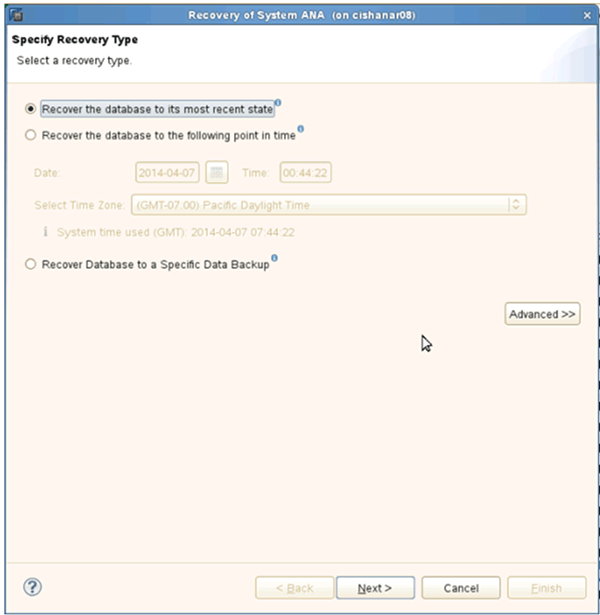
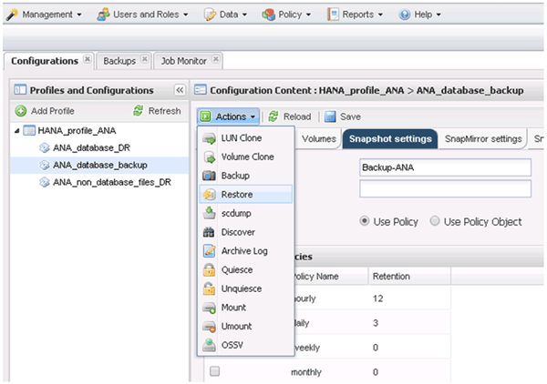

= Wiederherstellung von Datenbanken aus sekundärem Storage
:allow-uri-read: 
:icons: font
:imagesdir: ../media/

[role="lead"]
Sie können die Datenbank aus dem sekundären Storage wiederherstellen.

. Wählen Sie in SAP HANA Studio *Recover* für das SAP HANA-System aus.
+
image::../media/sap_hana_recovery_secondary_storage_gui.gif[Dieses Bild wird durch den umgebenden Text erläutert.]

+
Das SAP HANA-System wird heruntergefahren.

. Wählen Sie den Wiederherstellungstyp aus und klicken Sie auf *Weiter*.
+

. Geben Sie Log-Backup-Speicherorte an und klicken Sie auf *Next*.
+
image::../media/sap_hana_secondary_log_backup_locations.gif[Dieses Bild wird durch den umgebenden Text erläutert.]

+
Die Liste der verfügbaren Backups wird basierend auf dem Inhalt des Backup-Katalogs angezeigt.

. Wählen Sie die erforderliche Sicherung und notieren Sie sich die externe Backup-ID.
+
image::../media/sap_hana_recover_secondary_select_backup.gif[Dieses Bild wird durch den umgebenden Text erläutert.]

. Wechseln Sie zur Snap Creator GUI.
. Wählen Sie das SAP HANA-System aus und klicken Sie dann auf *Aktionen* > *Wiederherstellen*.
+

+
Der Begrüßungsbildschirm wird angezeigt.

+
image::../media/sap_hana_secondary_welcome_screen.gif[Dieses Bild wird durch den umgebenden Text erläutert.]

. Klicken Sie Auf *Weiter*.
. Wählen Sie *Sekundär* und klicken Sie auf *Weiter*.
+
image::../media/sap_hana_secondary_restore.gif[Dieses Bild wird durch den umgebenden Text erläutert.]

. Geben Sie die erforderlichen Informationen ein. Der Snapshot-Name steht im Zusammenhang mit der Backup-ID, die in SAP HANA Studio ausgewählt wurde.
+
image::../media/sap_hana_select_backup_restore04_secondary_scf_gui.gif[Dieses Bild wird durch den umgebenden Text erläutert.]

. Wählen Sie *Fertig*.
+
image::../media/sap_hana_secondary_restore_summary.gif[Dieses Bild wird durch den umgebenden Text erläutert.]

. Klicken Sie auf *Ja*, um weitere Elemente zur Wiederherstellung hinzuzufügen.
+
image::../media/sap_hana_secondary_snapshot_settings_warning.gif[Dieses Bild wird durch den umgebenden Text erläutert.]

. Geben Sie die erforderlichen Informationen für alle Volumes an, die wiederhergestellt werden müssen. Im Setup Data_00001 müssen Data_00002 und Data_00003 für den Wiederherstellungsprozess ausgewählt werden.
+
image::../media/sap_hana_secondary_snapvault_restore.gif[Dieses Bild wird durch den umgebenden Text erläutert.]

. Wenn alle Volumes ausgewählt sind, wählen Sie *OK* aus, um den Wiederherstellungsprozess zu starten.
+
Warten Sie, bis der Wiederherstellungsprozess abgeschlossen ist.

. Mounten Sie auf jedem Datenbank-Node alle Daten-Volumes neu und „`STale NFS Handles`“.
+
In dem Beispiel müssen alle drei Volumes auf jedem Datenbankknoten neu eingebunden werden.

+
[listing]
----
mount -o remount /hana/data/ANA/mnt00001
mount -o remount /hana/data/ANA/mnt00002
mount -o remount /hana/data/ANA/mnt00003
----
. Gehen Sie zu SAP HANA Studio und klicken Sie auf *Aktualisieren*, um die Sicherungsliste zu aktualisieren.
+
image::../media/sap_hana_secondary_select_backup_to_recover.gif[Dieses Bild wird durch den umgebenden Text erläutert.]

. Das mit Snap Creator wiederhergestellte Backup wird durch ein grünes Symbol in der Liste der Backups angezeigt. Wählen Sie das Backup aus und klicken Sie auf *Weiter*.
. Wählen Sie weitere Einstellungen nach Bedarf aus und klicken Sie auf *Weiter*.
+
image::../media/sap_hana_secondary_other_settings.gif[Dieses Bild wird durch den umgebenden Text erläutert.]

. Klicken Sie Auf *Fertig Stellen*.
+
image::../media/sap_hana_secondary_review_recovery_settings.gif[Dieses Bild wird durch den umgebenden Text erläutert.]

+
Der Wiederherstellungsprozess beginnt.

+
image::../media/sap_hana_secondary_recovery_progress_information.gif[Dieses Bild wird durch den umgebenden Text erläutert.]

. Setzen Sie nach Abschluss des Recovery-Prozesses ggf. die SnapVault Beziehungen fort.
+
image::../media/sap_hana_secondary_recovery_execution_summary.gif[Dieses Bild wird durch den umgebenden Text erläutert.]

