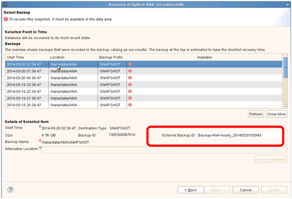
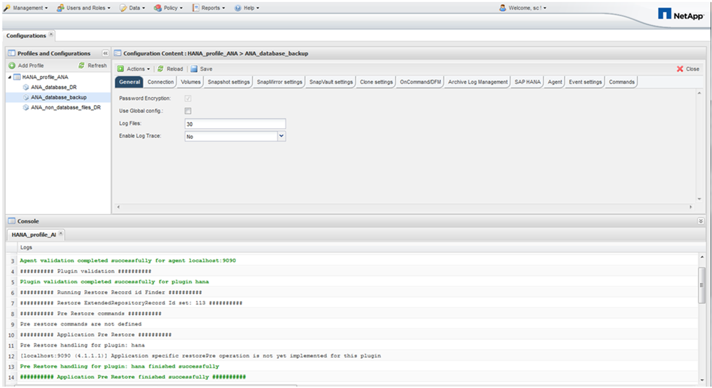

= Wiederherstellung von Datenbanken aus dem Primärspeicher
:allow-uri-read: 
:icons: font
:imagesdir: ../media/

[role="lead"]
Sie können die Datenbank aus dem primären Storage wiederherstellen.

NOTE: Sie können keine dateibasierten Backup Kopien von Snap Creator wiederherstellen.

. Wählen Sie in SAP HANA Studio *Recover* für das SAP HANA-System aus.
+
image::../media/sap_hana_recover_primary_gui.gif[Dieses Bild wird durch den umgebenden Text erläutert.]

+
Das SAP HANA-System wird heruntergefahren.

. Wählen Sie den Wiederherstellungstyp aus und klicken Sie auf *Weiter*.
+
image::../media/sap_hana_specify_recovery_type_gui.gif[Dieses Bild wird durch den umgebenden Text erläutert.]

. Geben Sie die Log-Backup-Speicherorte an und klicken Sie auf *Next*.
+
image::../media/sap_hana_recover_primary_log_backup_location.gif[Dieses Bild wird durch den umgebenden Text erläutert.]

+
Die Liste der verfügbaren Backups, die Sie sehen, basiert auf dem Inhalt des Backup-Katalogs.

. Wählen Sie die gewünschte Sicherung aus und notieren Sie die externe Backup-ID.
+

. Deaktivieren der SnapVault-Beziehung.
+

NOTE: Dieser Schritt ist nur bei Clustered Data ONTAP erforderlich.

+
Wenn Sie eine Snapshot Kopie wiederherstellen müssen, die älter als die Snapshot Kopie ist, die derzeit als Basis-Snapshot Kopie für SnapVault verwendet wird, müssen Sie zuerst die SnapVault-Beziehung in Clustered Data ONTAP deaktivieren. Führen Sie dazu folgende Befehle an der Backup-Cluster-Konsole aus:

+
[listing]
----
hana::> snapmirror quiesce -destination-path hana2b:backup_hana_data
Operation succeeded: snapmirror quiesce for destination hana2b:backup_hana_data.

hana::> snapmirror delete -destination-path hana2b:backup_hana_data
Operation succeeded: snapmirror delete the relationship with destination hana2b:backup_hana_data.

hana::> snapmirror release -destination-path hana2b:backup_hana_data
[Job 6551] Job succeeded: SnapMirror Release Succeeded
----
. Wählen Sie in der Snap Creator GUI das SAP HANA-System aus und wählen Sie dann *Aktionen* > *Wiederherstellen* aus.
+
image::../media/sap_hana_select_restore_backup.gif[Dieses Bild wird durch den umgebenden Text erläutert.]

+
Der Bildschirm Willkommen im Snap Creator Framework Restore Wizard wird angezeigt.

. Klicken Sie Auf *Weiter*.
+
image::../media/sap_hana_primary_restore_welcome_screen.gif[Dieses Bild wird durch den umgebenden Text erläutert.]

. Wählen Sie *Primär* und klicken Sie auf *Weiter*.
+
image::../media/sap_hana_primary_restore_primary_select.gif[Dieses Bild wird durch den umgebenden Text erläutert.]

. Wählen Sie Restore aus dem primären Storage aus.
. Wählen Sie den Storage-Controller, den Volume-Namen und den Snapshot-Namen aus.
+
Der Snapshot-Name steht im Zusammenhang mit der Backup-ID, die im SAP HANA Studio ausgewählt wurde.

+
image::../media/sap_hana_select_backup_restore_scf_gui.gif[Dieses Bild wird durch den umgebenden Text erläutert.]

. Klicken Sie Auf *Fertig Stellen*.
+
image::../media/sap_hana_primary_restore_summary.gif[Dieses Bild wird durch den umgebenden Text erläutert.]

. Klicken Sie auf *Ja*, um weitere wiederherzustellende Elemente hinzuzufügen.
+
image::../media/sap_hana_add_more_restore_items.gif[Dieses Bild wird durch den umgebenden Text erläutert.]

. Wählen Sie den Storage Controller, den zusätzlichen Volume-Namen und den Namen des Snapshot aus.
+
Der Snapshot-Name steht im Zusammenhang mit der Backup-ID, die im SAP HANA Studio ausgewählt wurde.

+
image::../media/sap_hana_primary_select_restore_details.gif[Dieses Bild wird durch den umgebenden Text erläutert.]

. Wiederholen Sie die Schritte 10 bis 13, bis alle erforderlichen Volumes hinzugefügt werden; in unserem Beispiel müssen Data_00001, Data_00002 und Data_00003 für den Wiederherstellungsprozess ausgewählt werden.
. Wenn alle Volumes ausgewählt sind, klicken Sie auf *OK*, um den Wiederherstellungsprozess zu starten.
+
image::../media/sap_hana_select_volume_restore.gif[Dieses Bild wird durch den umgebenden Text erläutert.]

+
Die Wiederherstellung wird gestartet.

+

+
Warten Sie, bis der Wiederherstellungsprozess abgeschlossen ist.

. Mounten Sie auf jedem Datenbank-Node alle Datenvolumes neu, um veraltete NFS-Handles zu reinigen.
+
In dem Beispiel müssen alle drei Volumes auf jedem Datenbankknoten neu eingebunden werden.

+
[listing]
----
mount -o remount /hana/data/ANA/mnt00001
mount -o remount /hana/data/ANA/mnt00002
mount -o remount /hana/data/ANA/mnt00003
----
. Gehen Sie zu SAP HANA Studio und klicken Sie auf *Aktualisieren*, um die Liste der verfügbaren Backups zu aktualisieren.
+
image::../media/sap_hana_primary_select_backup.gif[Dieses Bild wird durch den umgebenden Text erläutert.]

+
Das mit Snap Creator wiederhergestellte Backup wird durch ein grünes Symbol in der Liste der Backups angezeigt.

. Wählen Sie das Backup aus und klicken Sie auf *Weiter*.
+
image::../media/sap_hana_select_backup_to_recover_database.gif[Dieses Bild wird durch den umgebenden Text erläutert.]

. Wählen Sie weitere Einstellungen nach Bedarf aus und klicken Sie auf *Weiter*.
+
image::../media/sap_hana_select_backup_other_settings.gif[Dieses Bild wird durch den umgebenden Text erläutert.]

. Klicken Sie Auf *Fertig Stellen*.
+
image::../media/sap_hana_primary_review_recory_settings.gif[Dieses Bild wird durch den umgebenden Text erläutert.]

+
Der Wiederherstellungsprozess beginnt.

+
image::../media/sap_hana_primary_recovery_progress_information.gif[Dieses Bild wird durch den umgebenden Text erläutert.]

. Setzen Sie nach Abschluss der Recovery ggf. die SnapVault Beziehungen fort.
+
image::../media/sap_hana_primary_recovery_execution_summary.gif[Dieses Bild wird durch den umgebenden Text erläutert.]

