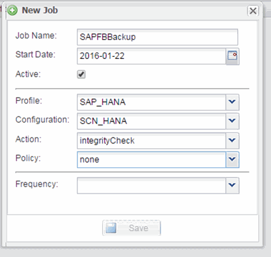

= Planen der Datenbankintegritätsprüfungen
:allow-uri-read: 
:icons: font
:imagesdir: ../media/

[role="lead"]
Für SAP HANA Konfigurationen können zusätzliche Vorgänge, wie z. B. dateibasierte Backups und Integritätsprüfungen für Datenbanken, geplant werden. Sie können den Betrieb der Datenbankintegritätsprüfungen in bestimmten Intervallen planen.

. Wählen Sie im Hauptmenü der Snap Creator GUI die Option *Verwaltung* > *Zeitpläne* und klicken Sie auf *Erstellen*.
. Geben Sie im Fenster Neuer Job die Details für den Job ein.
+
Die Integritätsprüfung ist standardmäßig auf „`none`“ eingestellt.

+

